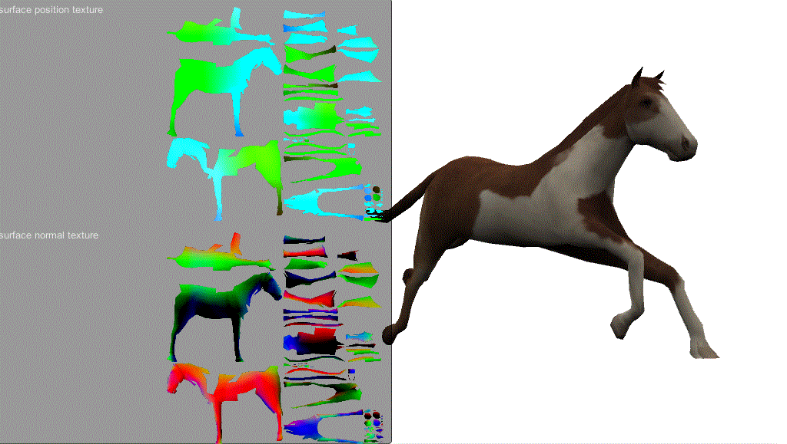
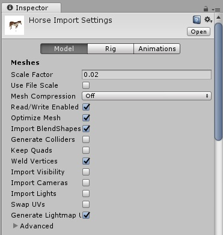
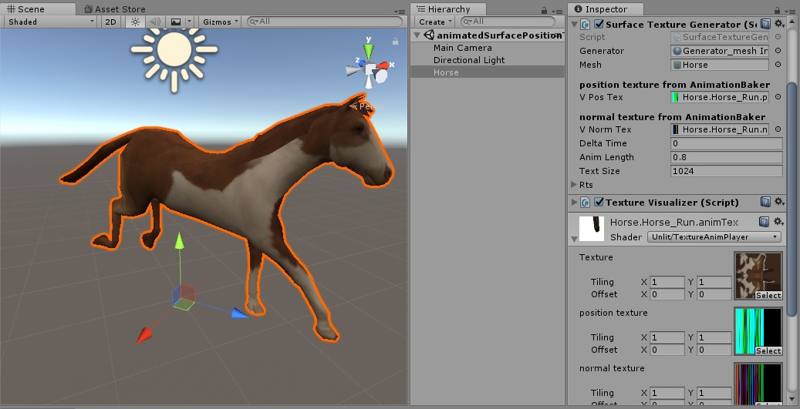

# Animated Surface-Position-Texture Generator for Unity

## Description

- Use with [Animation Texture Baker](https://github.com/sugi-cho/Animation-Texture-Baker)
- Generate Surface-Position-Texture. (and Normal-Texture)
- アニメーションメッシュの頂点の位置テクスチャから、メッシュの表面の位置テクスチャを生成する。

## Setup

- You need check "Generate Lightmap UVs" in importSettings.
- Lightmap UV(uv2) is used for generate texture.

- Setup textures generated from Animation Texture Baker, to inspector.
- Then, run.
- Call `SurfaceTextureGenerator.UpdateRts()`.
- `SurfaceTextureGenerator.surfacePosTex` and `SurfaceTextureGenerator.surfaceNormTex` for get textures.

## Horse

horse is from Unity [AssetStore](https://www.assetstore.unity3d.com/jp/#!/content/16687). big up
